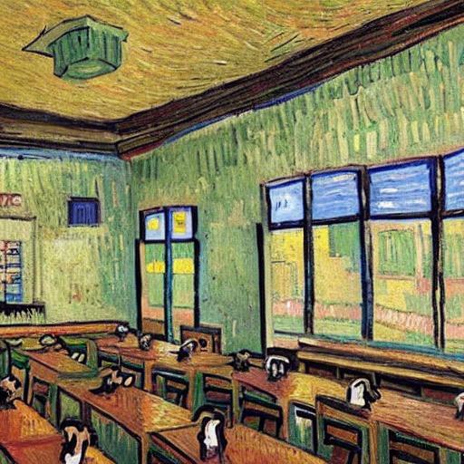

为您重新排版后的 README 文档如下，优化了层级结构、代码块展示和视觉引导，使其更符合开源项目的规范与阅读体验：

🎨 SD-LoRA 多画风图像生成器

📖 项目介绍
本项目是一款基于 Stable Diffusion 模型结合 LoRA 微调权重 开发的专属画风生成工具。针对原生 SD 模型生成画面风格杂乱、辨识度低、画风不统一的问题，通过引入多组专属 LoRA 微调权重，精准锁定各类艺术画风，大幅提升生成图片的风格贴合度与艺术质感，可快速生成高适配、高还原度的风格化图像。

项目内置多种成熟画风权重，开箱即用，同时支持自定义扩展新画风。操作简单、生成效果稳定，适合 AI 艺术创作、素材设计、风格化配图等场景。

✨ 核心特性
🎯 风格精准还原：基于 LoRA 微调训练，相比原生 SD 模型，生成画面高度贴合目标艺术画风，细节风格统一。
🎭 多画风支持：内置多款主流艺术风格权重，可自由切换、按需调用。
🔒 纯本地离线运行：支持离线模式，无需访问境外网络，彻底解决模型联网下载失败问题。
🪶 轻量化易部署：代码简洁易懂，提供完整示例脚本，零基础可快速运行。
🧩 高扩展性：可自行新增、替换 LoRA 权重，拓展更多自定义画风。

📁 项目结构
CartoonistHelper/
├── getPicture.py       # 核心运行示例脚本，画风图像生成入口
├── lora_models/        # 存放所有 LoRA 微调画风权重文件夹
│   └── VanGogh/        # 示例：梵高艺术画风权重
├── output3.png         # 项目生成效果成品展示图
└── README.md           # 项目说明文档

💻 环境依赖
项目基于 Python 开发，需安装以下依赖库：
pip install torch diffusers transformers safetensors

🚀 快速运行

环境配置
安装上述全部依赖，确保 Python 环境正常（推荐使用虚拟环境运行）。

权重配置
将所需 LoRA 画风权重文件夹放入 lora_models 目录下，支持自定义新增多种画风权重。

离线模式配置（必配）
⚠️ 注意：此步骤用于解决 Hugging Face 联网报错问题。

在脚本内添加全局离线配置，彻底规避联网访问失败：
import os

开启离线模式，禁止联网拉取模型
os.environ["HF_HUB_OFFLINE"] = "1"

运行生成脚本
python getPicture.py

运行完成后，即可生成对应画风的图像，成品效果参考 output3.png。

🖼️ 效果展示
以下为本项目通过 LoRA 微调权重生成的风格化图像效果，完美还原专属艺术画风：

用梵高风格生成的教室：

🛠️ 常见问题解决 (FAQ)
问题现象   解决方案
联网报错 / 无法访问 HuggingFace   开启 HF_HUB_OFFLINE=1 离线模式，全程本地加载权重，无需联网。

找不到 LoRA 模型文件   修改代码中权重路径为相对路径，避免根目录路径错误。

画风效果不明显   调整 LoRA 权重加载参数，或替换适配度更高的微调权重。

📌 拓展说明
项目默认内置梵高等经典画风，用户可自行训练/下载各类 LoRA 权重，放入对应目录即可使用。
所有模型均为本地加载，数据安全无联网风险，非常适合本地批量生成创作素材。
可基于示例脚本进行二次开发，自定义提示词（Prompt）、生成尺寸、画风强度等参数。

📄 许可证
⚖️ 免责声明：本项目仅供个人学习、非商业创作使用，严禁用于违规商业用途。
💡 排版优化说明：增加了 Emoji 图标提升可读性；将代码和命令行包裹在标准代码块中；使用表格重构了 FAQ 部分，使问题和解决方案一目了然；修复了原结构中 output.3 的拼写错误，统一为 output3.png。您可以直接将其复制到 GitHub/Gitee 的 README.md 中使用。